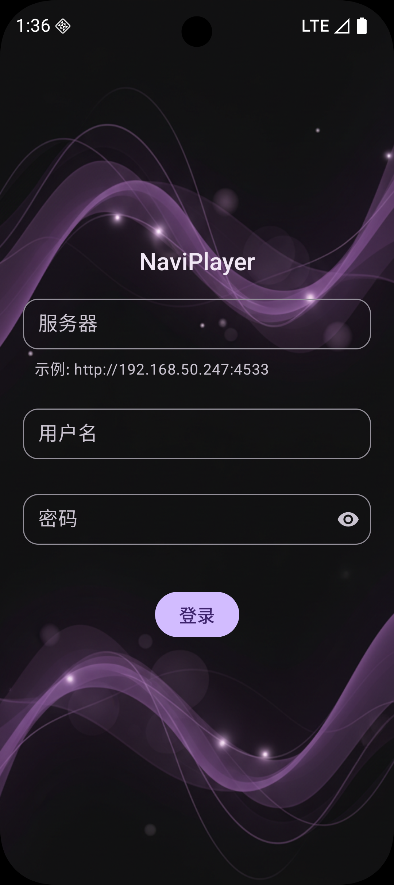
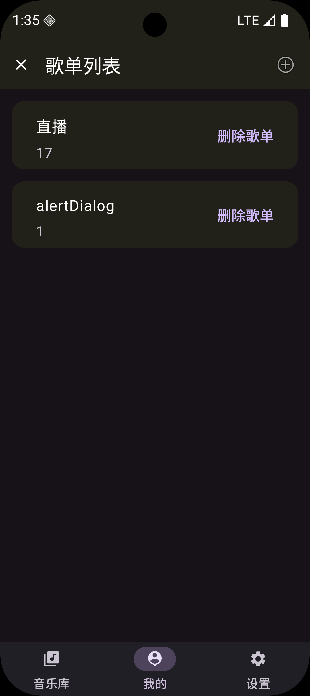
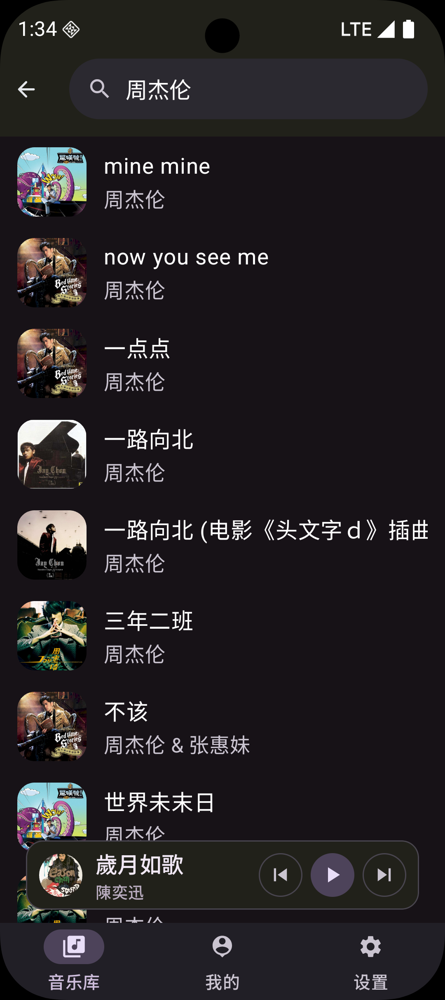
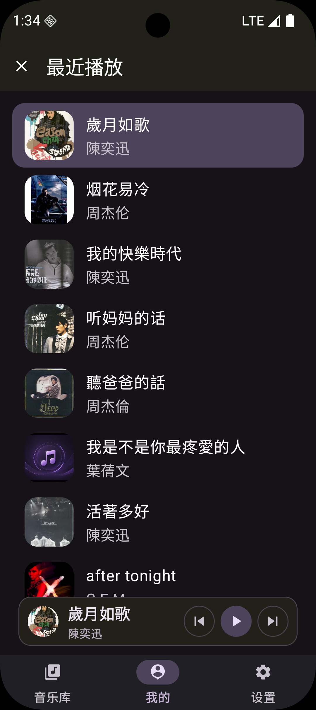
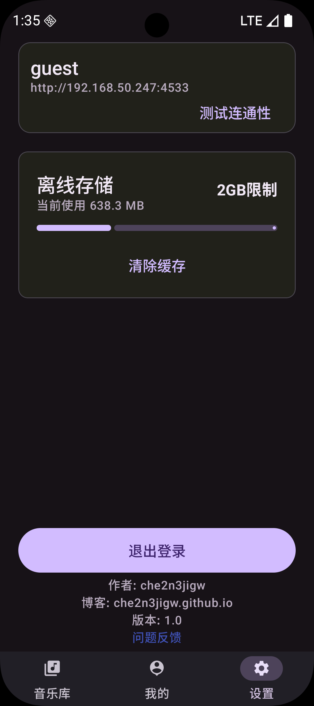
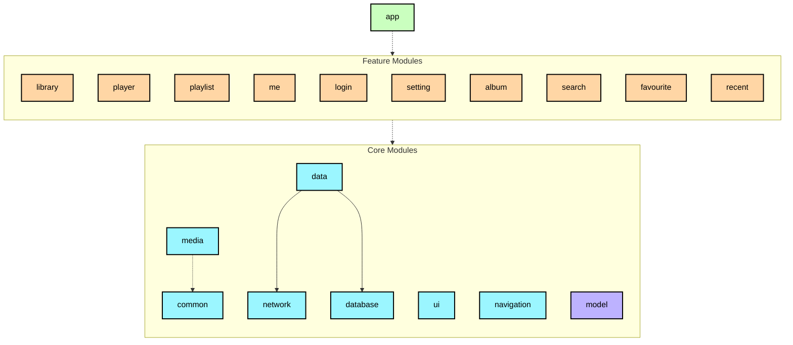

# NaviPlayer 🎵

NaviPlayer 是一款基于现代 Android 开发技术栈构建的音乐播放器。

本项目深受 [nowinandroid](https://github.com/android/nowinandroid) 的启发，严格遵循其推荐的模块化架构、单向数据流 (UDF) 以及 Android 最佳实践。

## 🎯 设计初衷

NaviPlayer 专为 **Navidrome** 服务器量身定制，旨在提供极致的流媒体听歌体验。由于 Navidrome 完美遵循 **Subsonic/OpenSubsonic API** 标准，本项目理论上也兼容 Gonic, Airsonic 等服务器，但目前主要针对 Navidrome 进行优化、测试与适配。

## 📱 截图展示 / Screenshots

| 登录 / Login | 音乐库 / Library | 播放器 / Player |
| :---: | :---: | :---: |
|  |  |  |

| 个人中心 / Me | 歌单列表 / Playlists | 歌单详情 / Playlist Detail |
| :---: | :---: | :---: |
|  |  |  |

| 我的收藏 / Favorites | 搜索 / Search | 最近播放 / Recent |
| :---: | :---: | :---: |
|  |  |  |

| 设置 / Setting |
| :---: |
|  |

## ✨ 特性

- **现代化架构**: 参考 nowinandroid，采用多模块 (Multi-module) 与 **Clean Architecture (整洁架构)**，逻辑分层清晰，解耦彻底。
- **Navidrome 深度适配**: 完美支持流媒体播放、歌单同步、收藏夹等核心 Subsonic 功能。
- **Material Design 3**: 遵循最新设计规范，支持动态色彩 (Dynamic Color) 和完美的深色模式。
- **核心功能**:
  - **音乐库浏览**: 按专辑、歌手、歌曲等维度快速检索。
  - **强大播放器**: 基于 Media3 (ExoPlayer) 构建，支持封面、进度控制及实时播放队列管理。
  - **歌单管理**: 支持创建、删除及编辑个人歌单。
  - **个人中心**: 聚合最近播放、收藏歌曲、登录历史等。
  - **多语言支持**: 现已支持 **中文 (简体)** 和 **英文 (English)**。

## 🛠️ 技术栈

- **核心语言**: [Kotlin](https://kotlinlang.org/)
- **异步处理**: [Coroutines](https://kotlinlang.org/docs/coroutines-overview.html) & [Flow](https://kotlinlang.org/docs/flow.html)
- **依赖注入**: [Hilt](https://developer.android.com/training/dependency-injection/hilt-android)
- **多媒体引擎**: [Jetpack Media3 (ExoPlayer)](https://developer.android.com/guide/topics/media/media3)
- **导航框架**: [Jetpack Navigation](https://developer.android.com/guide/navigation)
- **图片加载**: [Coil](https://coil-kt.github.io/coil/)
- **网络层**: [Retrofit](https://square.github.io/retrofit/) & [OkHttp](https://square.github.io/okhttp/)
- **数据持久化**: [Room](https://developer.android.com/training/data-storage/room) & [DataStore](https://developer.android.com/topic/libraries/architecture/datastore)

## 🏗️ 项目架构

项目遵循 **Clean Architecture** 规范，通过模块化将代码划分为两个维度：

### 1. 逻辑分层 (Logical Layers)
- **UI Layer**: 处理界面显示与用户交互，使用 `ViewModel` 驱动并遵循 UDF。
- **Domain Layer**: (可选) 封装复杂的业务逻辑 (UseCases)。
- **Data Layer**: 负责数据获取与持久化，通过 `Repository` 模式统一暴露数据。

### 2. 物理模块化 (Physical Modules)
- **`:app`**: 壳工程，负责全局配置与初始化。
- **`:feature:xxx`**: 业务功能模块，包含该功能的 UI 层。
- **`:core:xxx`**: 核心底层模块，为功能模块提供支撑。

## 🚀 快速开始

1. **克隆项目**: `git clone https://github.com/che2n3jigw/NaviPlayer.git`
2. **环境准备**: Android Studio Koala+, JDK 17+。
3. **配置服务器**: 启动应用，输入 Navidrome/Subsonic 地址及账号信息。
4. **编译运行**: 运行 `app` 模块。

## 📄 开源协议

本项目采用 [MIT License](LICENSE) 开源。

---
Copyright © 2026 che2n3jigw.
