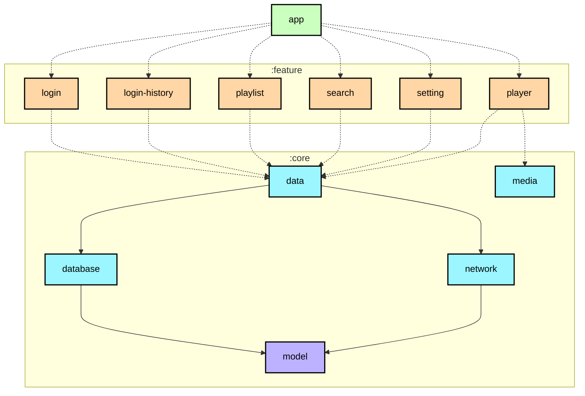

```mermaid
graph TB
	subgraph :core
		direction TB
		:core:data[data]:::android-library
		:core:database[database]:::android-library
		:core:model[model]:::jvm-library
		:core:network[network]:::android-library
		:core:media[media]:::android-library
	end
	subgraph :feature
		direction TB
		:feature:login[login]:::android-feature
		:feature:login-history[login-history]:::android-feature
		:feature:playlist[playlist]:::android-feature
		:feature:search[search]:::android-feature
		:feature:setting[setting]:::android-feature
		:feature:player[player]:::android-feature
	end
	:app[app]:::android-application
	
	:app -.-> :feature:login
	:app -.-> :feature:login-history
	:app -.-> :feature:playlist
	:app -.-> :feature:search
	:app -.-> :feature:setting
	:app -.-> :feature:player
	:feature:login -.-> :core:data
	:feature:login-history -.-> :core:data
	:feature:playlist -.-> :core:data
	:feature:search -.-> :core:data
	:feature:setting -.-> :core:data
	:feature:player -.-> :core:data
	:feature:player -.-> :core:media
	:core:data ---> :core:database
	:core:data ---> :core:network
	:core:database ---> :core:model
	:core:network ---> :core:model
	
classDef android-application fill:#CAFFBF,stroke:#000,stroke-width:2px,color:#000;
classDef android-feature fill:#FFD6A5,stroke:#000,stroke-width:2px,color:#000;
classDef android-library fill:#9BF6FF,stroke:#000,stroke-width:2px,color:#000;
classDef jvm-library fill:#BDB2FF,stroke:#000,stroke-width:2px,color:#000;
	
```

