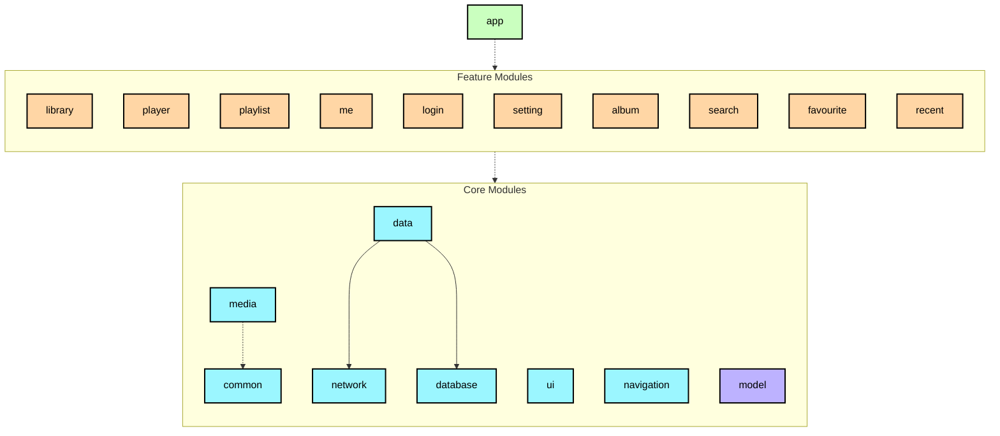

# NaviPlayer 🎵

NaviPlayer is a music player built with modern Android development technologies.

Highly inspired by [nowinandroid](https://github.com/android/nowinandroid), this project strictly follows the recommended multi-module architecture, Unidirectional Data Flow (UDF), and Android best practices.

## 🎯 Design Philosophy

NaviPlayer is tailor-made for **Navidrome** servers, aiming to provide the ultimate streaming experience. Since Navidrome perfectly adheres to the **Subsonic/OpenSubsonic API** standards, this project is theoretically compatible with Gonic, Airsonic, and other compatible servers, though it is primarily optimized and tested for Navidrome.

## 📱 Screenshots

| Login | Library | Player |
| :---: | :---: | :---: |
|  |  |  |

| Me | Playlists | Playlist Detail |
| :---: | :---: | :---: |
|  |  |  |

| Favorites | Search | Recent |
| :---: | :---: | :---: |
|  |  |  |

| Setting |
| :---: |
|  |

## ✨ Features

- **Modern Architecture**: Inspired by nowinandroid, utilizing a Multi-module and **Clean Architecture** approach for clear separation of concerns.
- **Navidrome Deep Integration**: Full support for streaming, playlist synchronization, favorites, and other core Subsonic features.
- **Material Design 3**: Follows the latest design guidelines, supporting Dynamic Color and a polished Dark Mode.
- **Core Functionalities**:
  - **Library Browsing**: Quick access to albums, artists, and songs.
  - **Powerful Player**: Built on Media3 (ExoPlayer), supporting cover art, progress control, and real-time play queue management.
  - **Playlist Management**: Create, delete, and edit personal playlists.
  - **User Center**: Aggregates recent plays, favorite songs, login history, etc.
  - **Multi-language Support**: Now supports **Chinese (Simplified)** and **English**.

## 🛠️ Tech Stack

- **Core Language**: [Kotlin](https://kotlinlang.org/)
- **Asynchronous**: [Coroutines](https://kotlinlang.org/docs/coroutines-overview.html) & [Flow](https://kotlinlang.org/docs/flow.html)
- **Dependency Injection**: [Hilt](https://developer.android.com/training/dependency-injection/hilt-android)
- **Media Engine**: [Jetpack Media3 (ExoPlayer)](https://developer.android.com/guide/topics/media/media3)
- **Navigation**: [Jetpack Navigation](https://developer.android.com/guide/navigation)
- **Image Loading**: [Coil](https://coil-kt.github.io/coil/)
- **Networking**: [Retrofit](https://square.github.io/retrofit/) & [OkHttp](https://square.github.io/okhttp/)
- **Persistence**: [Room](https://developer.android.com/training/data-storage/room) & [DataStore](https://developer.android.com/topic/libraries/architecture/datastore)

## 🏗️ Architecture

The project follows the **Clean Architecture** principles and is organized into three core layers through modularization:

### 1. Logical Layers
- **UI Layer**: Handles UI display and user interaction, driven by `ViewModel` using UDF.
- **Domain Layer (Optional)**: Encapsulates complex business logic into `UseCases`.
- **Data Layer**: Responsible for data retrieval and persistence, exposed through `Repositories`.

### 2. Physical Modules
- **`:app`**: The entry point, responsible for global configuration and initialization.
- **`:feature:xxx`**: Feature-specific modules (e.g., player, library, playlist), containing the UI layer for each feature.
- **`:core:xxx`**: Core underlying modules providing support for feature modules:

## 🚀 Quick Start

1. **Clone the project**: `git clone https://github.com/che2n3jigw/NaviPlayer.git`
2. **Prerequisites**: Android Studio Koala+, JDK 17+.
3. **Configuration**: Launch the app and login with your Navidrome/Subsonic credentials.
4. **Build & Run**: Run the `app` module.

## 📄 License

This project is licensed under the [MIT License](LICENSE).

---
Copyright © 2026 che2n3jigw.
